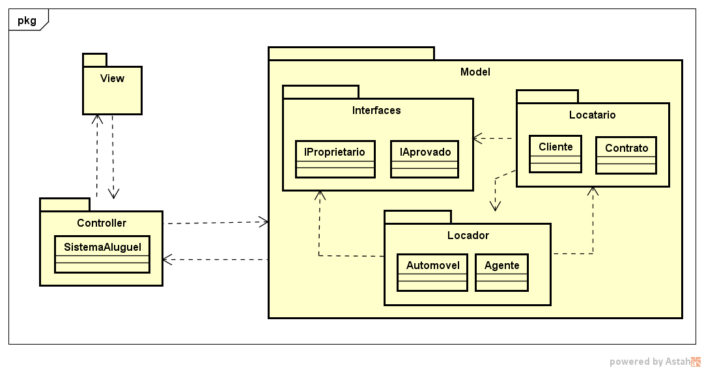

# Artefatos do projeto

Este diretório mantém os artefatos do projeto. 

Os artefatos do projeto estão separados da seguinte forma:
* `/Caso de Uso`
	* **README.md**: Descrição do diagrama de casos de uso.
	* **Sistema de Matrículas.asta**: Projeto feito no Astah do diagrama de casos de uso.
   

* `/Diagrama de Classes`
	* **README.md**: Descrição do diagrama de classes.
   

* `/Diagrama de pacote`
   

* `/Historia de usuário`
	* **backlog.md**: Descrição das histórias de usuário de acordo com os casos de uso.
 
| Usuário      | Requisito | Motivação     |Autor     |Status     |
| :----:        |    :----:   |          :----: |           :----: |            :----: |
| Como um usuário, eu quero | realizar cadastro | para salvar meus dados no sistema | Pedro Ramos Vidigal | Pendente |
| Como um usuário, eu quero | realizar login | para ter acesso as funcionalidades do programa | Pedro Ramos Vidigal | Pendente |
| Como um cliente, eu quero | introduzir pedidos | para poder alugar um veículo | Luiz Gustavo | Pendente |
| Como um cliente, eu quero | cancelar pedidos | de aluguel de veículos que não tenho mais interesse | Luiz Gustavo | Pendente |
| Como um cliente, eu quero | consultar pedidos | para ficar ciente dos alugueis que já fiz | Giovanni Duarte | Pendente |
| Como um cliente, eu quero | modificar pedidos | para corrigir eventuais erros que posso cometer ao realizar um pedido | Guilherme Drumond | Pendente |
| Como um agente, eu quero | avaliar os pedidos realizados | para verificar se os clientes estão em condições favoráveis de alugar um veículo | Amanda Moura | Pendente |
| Como um agente, eu quero | modificar pedidos de clientes | para corrigir eventuais erros que possam acontecer pelo sistema ou pelos clientes | Vitor Nunes Calhau | Pendente |

* `/Imagens`
	* Arquivo contendo todas as imagens utilizadas.
